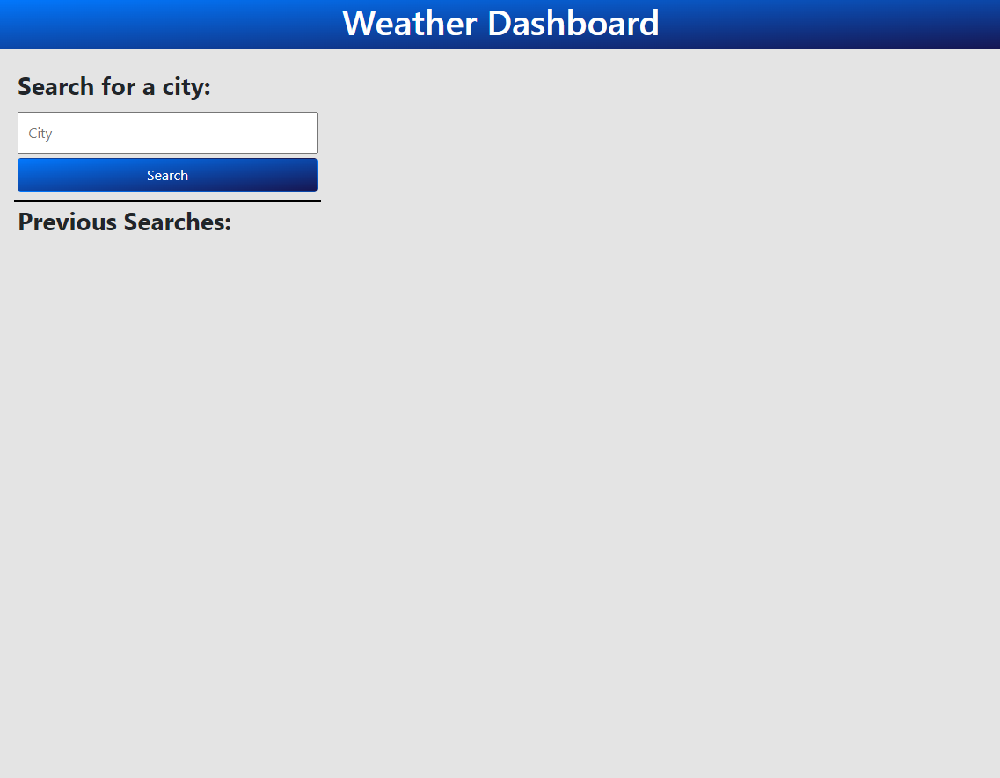
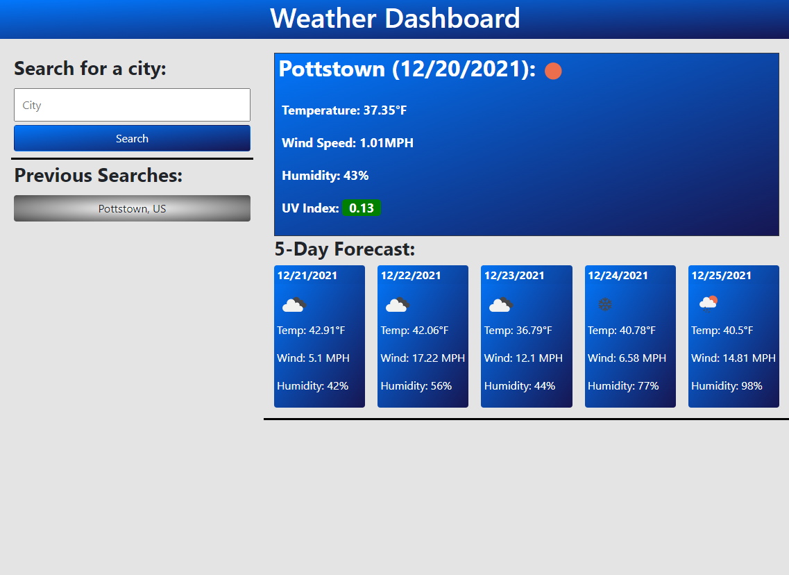
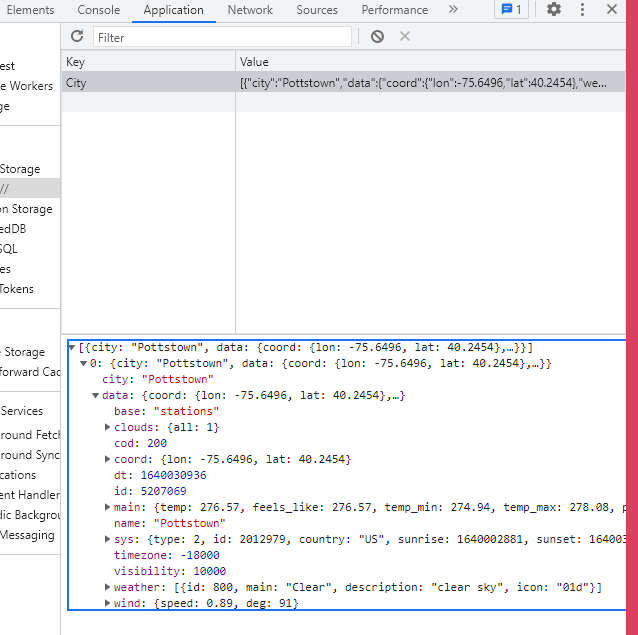
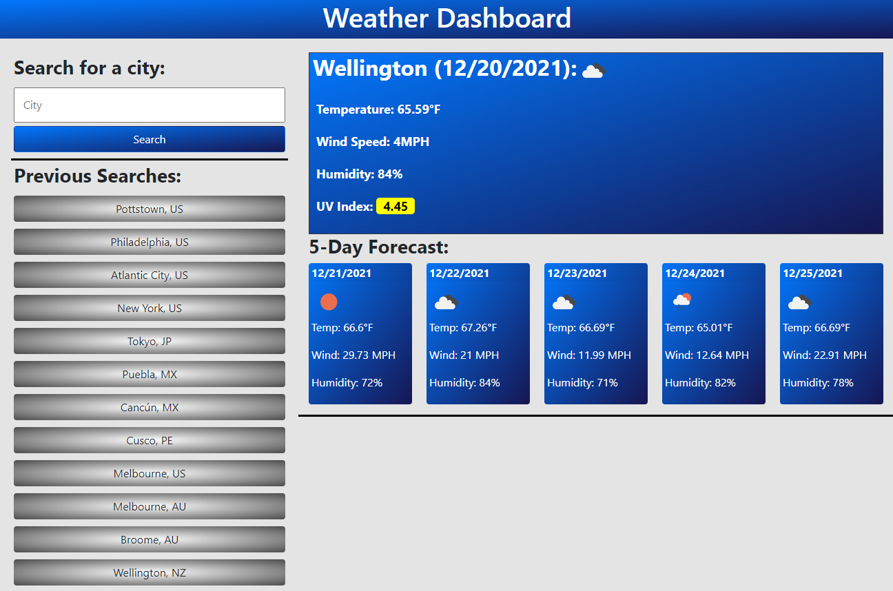
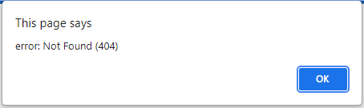
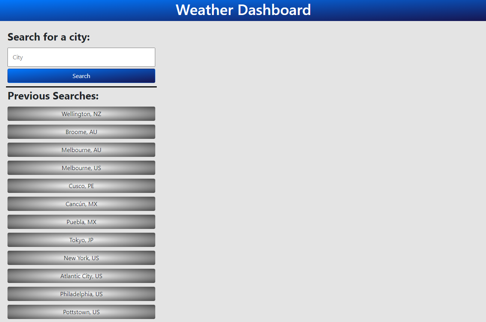

# weather-dashboard

## Description
The goal was to create a website to display the current and 5-day forecast of a city. This weather dashboard takes in a user-searched city and displays the weather conditions from openweathermap's api. The weather dashboard stores all previous searches locally, and displays those cities as clickable buttons on the page. It works for cities in the US and various other countries. During the creation of this website, I have learned how to use the fetch API and then method to obtain data from third party APIS. I also got more practice using DOM traversal to get the wanted information from the fetch and then methods. 

## Table of Contents (Optional)
- [Installation](#installation)
- [Usage](#usage)
- [Credits](#credits)
- [License](#license)
- [Features](#features)
- [Tests](#tests)

## Installation
N/A

## Usage
Here is a link to the deployed Weather Dashboard. [weather dashboard deployed link](https://maxstump13.github.io/weather-dashboard/)

When the page is loaded, the dashboard will appear as seen below. Because there is no locally stored searches, the screen will mostly be empty.

Once the user searches for a city, the current and forecasted weather conditions will be displayed on the page. The icons associated with the weather will also be displayed. 

Once a search has been made, the data is stored as a JSON object locally. 

The user is able to check the weather and forecast in multiple countries around the world. Below are some examples. Notice the color surrounding the UV Index also changed. The UV Index is color coded to represent low to high values.
.

If the user inputs a nonexistant city or a city not in the openweathermap database, an alert pops up informing the user of the error and error code. 

Because the previous searches are stored locally, they will populate the page even if it is refreshed or closed. 

## Credits
1. [MDN](https://developer.mozilla.org/en-US/)
2. [Tutsplus](https://tutsplus.com/?_ga=2.189473323.1003266245.1639752011-1575437401.1638298985)
3. [JQuery](https://jquery.com/)
4. [Openweathermap](https://openweathermap.org/)
5. [Moment](https://momentjs.com/)
6. [Bootstrap](https://getbootstrap.com/)
7. [W3](https://www.w3schools.com/)
8. [Stackoverflow](https://stackoverflow.com/)

## License
[License](./LICENSE)

## Badges
N/A

## Features
1. Search box that takes user input and the Fetch API method for current/forecasted weather conditions
2. Stores previous searches locally
3. layout built with bootstrap
4. Use of moment.js for current/forecast dates
5. Previous searches are clickable buttons
6. Works for cities world wide
7. Various functions/methods to aid readibility

## How to Contribute
If there are any suggestions to improve this generator, this is my [GitHub](https://github.com/MaxStump13) account. 

## Tests
I tested the functionality of the weather dashboard in a few ways. I typed random text and received the 404 error alert. I also searched the same city multiple times, but because of the conditional statements, it was not saved a second time. I confirmed the UV Index span changes colors at a higher UV index. The buttons for the previous section all will work as well, with updated information. This is because on click they are sent to the getCoordinates function, not just the displayWeather function.